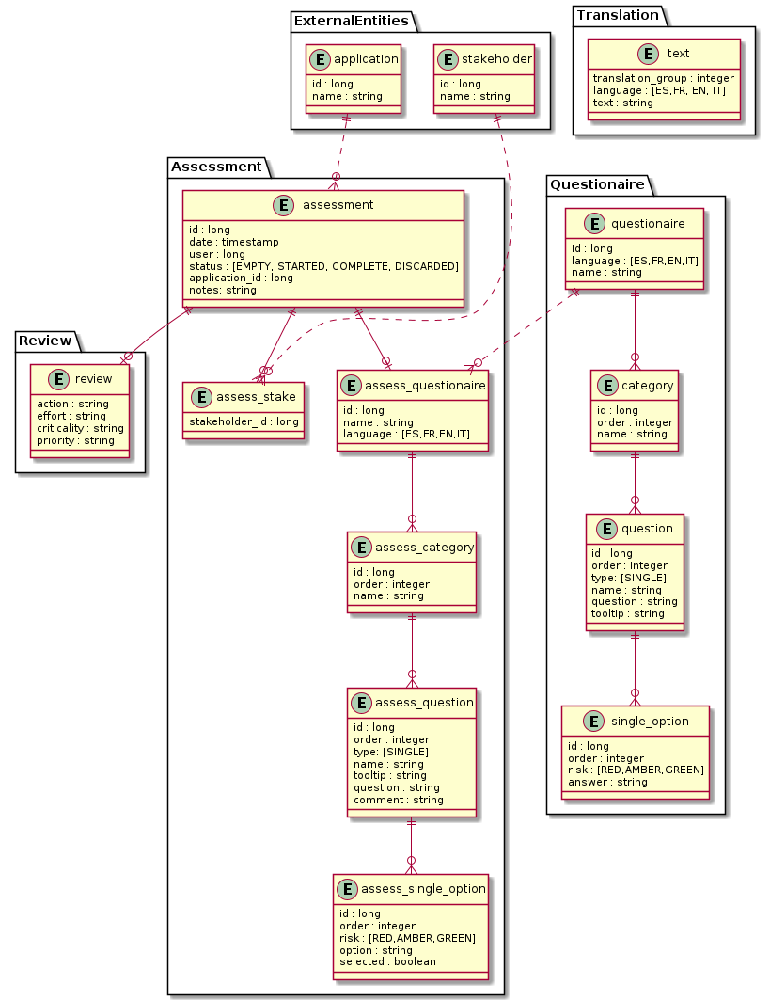
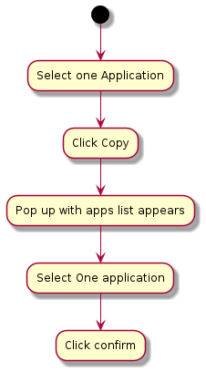

# Tackle Pathfinder application

It's the next version of the <https://github.com/redhat-cop/pathfinder> project.  

Pathfinder is an extensible, questionnaire based assessment tool for assessing the suitability of applications for deployment onto an enterprise Kubernetes platform.

## API

* use Apicurio to design the API first
* if the default docker-compose installation doesn't work ( for mysql issues) try full PostgreSQL approach ( <https://github.com/carlesarnal/apicurio-studio/tree/expand-docker-compose-db-choice-keycloak> )
* use [Microcks](https://microcks.io/blog/why-microcks/) to mock the API to test it and decouple Frontend from Backend

---

### **Installation**

#### **1. Minikube - Microcks**

1. install [Helm](https://helm.sh/docs/intro/install/)
2. install [Microcks](https://github.com/microcks/microcks/tree/master/install/kubernetes)

```shell
minikube start --kubernetes-version=v1.20.2 --cpus 4 --memory 8192

minikube addons enable ingress

helm repo add microcks https://microcks.io/helm

kubectl create namespace microcks

helm install microcks microcks/microcks --version 1.2.0 --namespace microcks --set microcks.url=microcks.$(minikube ip).nip.io --set keycloak.url=keycloak.$(minikube ip).nip.io

```

Check URL of microcks on the output : `Microcks is available at https://microcks.192.168.49.2.nip.io.` (that IP will change with yours)

Use `admin` or `user` as user and `microcks123` as password

#### **2. Local container - Microcks**

1. run microcks [dockercompose](https://microcks.io/documentation/getting-started/)

```shell
git clone https://github.com/microcks/microcks.git

cd microcks/install/docker-compose

docker-compose up -d
```

#### **3. Local container - Apicurito**

1. run apicurito

```shell
podman run -p 9080:8080 apicurio/apicurito-ui
```

#### **4. SaSS version - Apicurio**

1. go to `https://studio.apicur.io/`

#### **5. Openshift**

1. in your cluster install microcks & apicurio operators
1. go to secrets , my-microcksinstall-keycloak-admin, copy username and password
1. go to keycloak route login using those credentials
1. got to view all suers and set the password for admin
1. go to microcks route and log with those credentials

---

### API Design

1. go to apicurio URL
2. Open API , load the openapi.json file
3. Create/Edit the data types used by the operations
4. For each operation and verb generate the different Responses
5. For each response create examples ( these ones will be used by Microcks to generate the mocks )
   1. Generate 1 easy plain response
   2. Generate examples with Microcks [templating](https://microcks.io/documentation/using/advanced/templates/) to generate dynamic samples ( you can take a look to `GET info` operation )
6. Save as JSON overriding the openapi.json

### API Mocking

1. go to  microcks URL
2. go to "Importers" menu
3. click "upload" the file openapi.json
4. microcks will store all the dispatchers configured and apply them as long as we don't change the name and version of the API
5. to export microcks configuration go to "Administration" menu, then "Snapshots" and then "Export"
6. to import microcks configuration go to "Administration" menu, then "Snapshots" and then "Import Snapshot....Browse"
7. these import/export actions should be done everytime your microcks installation is recreated

### API Testing

1. on Microcks , in every operation with sample responses, we'll find a `Mock URL`
2. use this URL to send the requests to

## LOGIC

### Assessment


### Questionaire Design


## MODEL

* flattened model (denormalised shcmema)

* initial premisses :
  * no dependency between questions
  * no mandatory/optional questions
  * no multichoice questions
  * i18n capabilities
  * 1 application -> 1 assessment
  * only 1 questionaire



## FLOW

| Assess Application | Copy Assessment |
| :------------------: | :---------------: |
 |  |

## Local test

Run a Postgres container, a Keycloak one ( if you are running this application alone and not with the rest of Tackle modules ) and execute the application in dev mode.

### PostgreSQL

Start PostreSQL container with [Podman](https://podman.io/) executing this.

```Shell
podman run -it \
            --name postgres-pathfinder -e POSTGRES_USER=pathfinder \
            -e POSTGRES_PASSWORD=pathfinder -e POSTGRES_DB=pathfinder_db \
            -p 5433:5432 postgres:10.6
```

*NOTE* setting the port to 5433 to not interfere with other services PostgresSQL

### Keycloak

```Shell
podman run -it --name keycloak --rm \
            -e KEYCLOAK_USER=admin -e KEYCLOAK_PASSWORD=admin -e KEYCLOAK_IMPORT=/tmp/keycloak/quarkus-realm.json \
            -e DB_VENDOR=h2 -p 8180:8080 -p 8543:8443 -v ./src/main/resources/keycloak:/tmp/keycloak:Z \
            jboss/keycloak:12.0.2
```

It works the same with Docker just replacing `podman` with `docker` in the above command.

### Application

```Shell
./mvnw quarkus:dev
```

This will make Pathfinder to run on port 8085

### Call endpoints in dev mode

To do calls to application's endpoint while running it in dev mode, execute the following commands:

Configure security

```Shell
export access_token=$(\
    curl -X POST http://localhost:8180/auth/realms/quarkus/protocol/openid-connect/token \
    --user backend-service:secret \
    -H 'content-type: application/x-www-form-urlencoded' \
    -d 'username=alice&password=alice&grant_type=password' | jq --raw-output '.access_token' \
 )
```

Get list of assessments

```Shell
curl -X GET 'http://localhost:8085/pathfinder/assessments?applicationId=20' \
  -H 'Accept: application/json' -H "Authorization: Bearer "$access_token -v -s | jq
```

Create an assessment

```Shell
curl 'http://localhost:8085/pathfinder/assessments' \
  -H 'Content-Type: application/json' -H 'Accept: application/json' -H "Authorization: Bearer "$access_token \
  -d "{ \"applicationId\": 20 }" \
  -v -s | jq
```

 # Internationalization

 To contribute translating Tackle Pathfinder (questionnaire) into a new language please read [Internationalization](./INTERNATIONALIZATION)
