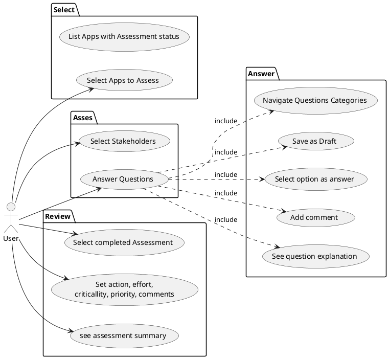
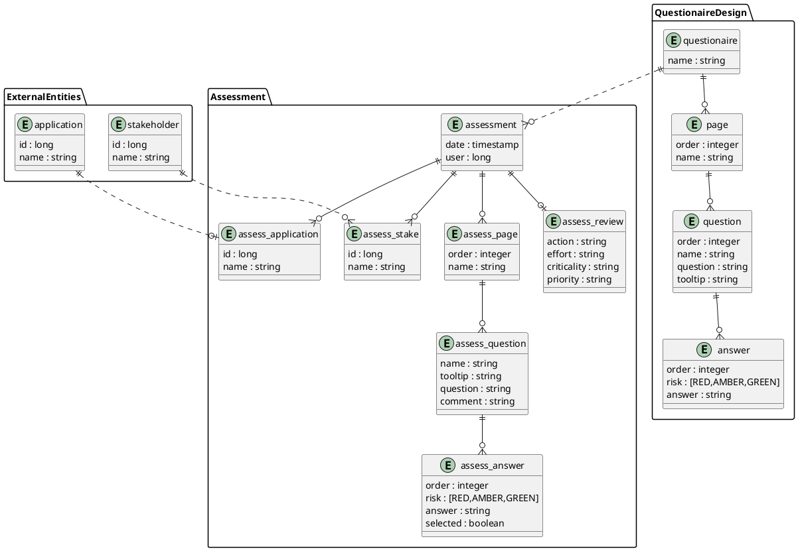

# Tackle Pathfinder application

It's the next version of the https://github.com/redhat-cop/pathfinder project.  

Pathfinder is an extensible, questionnaire based assessment tool for assessing the suitability of applications for deployment onto an enterprise Kubernetes platform.

# API 

* use Apicurio to design de API first
* use Microcks to mock the API to test it and decouple Frontend from Backend

# LOGIC

# MODEL

* flattened model (denormalised shcmema)
* no dependency between questions
* no mandatory/optional questions
* no multichoice questions

